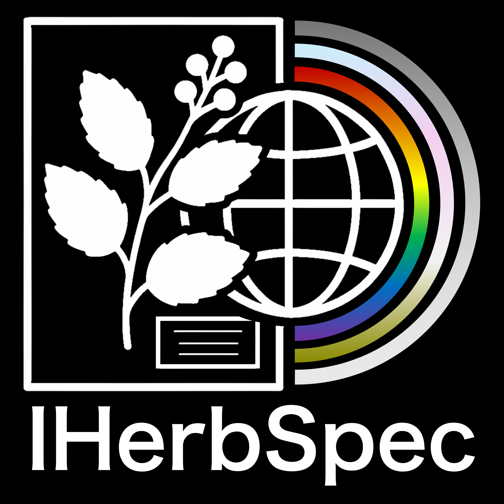
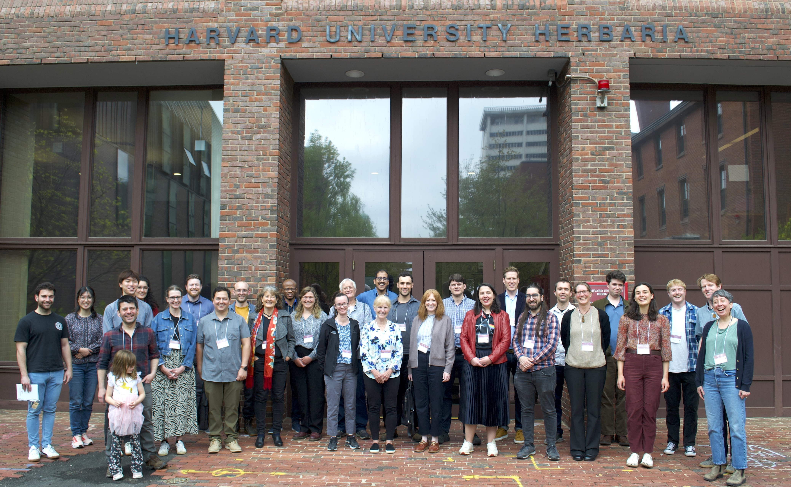

{fig-align="center" width="90%"}

---

::: {.columns .column-page-inset}
::: {.column width="35%"}
{width="260px"}
:::

::: {.column width="65%"}

The International Herbarium Spectral Digitization Working Group (IHerbSpec) is a global consortium advancing the collection and application of reflectance spectra from herbarium specimens to support integrative plant biology and biodiversity science.

Through the development of shared standards, protocols, and data-management practices, we facilitate the harmonization of spectral datasets while fostering collaborative research that connects institutions, disciplines, and communities worldwide.

:::
:::

<h2>Explore</h2>

<a class="explore-card" href="protocol.html">
  Protocol
  Standards, workflows, metadata, and best practices for herbarium spectral measurements.
</a>

<a class="explore-card" href="publications.html">
  Publications
  Selected publications from IHerbSpec members on herbarium spectroscopy and spectral data applications.
</a>

<a class="explore-card" href="people.html">
  People
  A list of IHerbSpec members.
</a>

<a class="explore-card" href="contact.html">
  Contact
  Connect with the working group.
</a>

---

{fig-align="center" width="90%"}
